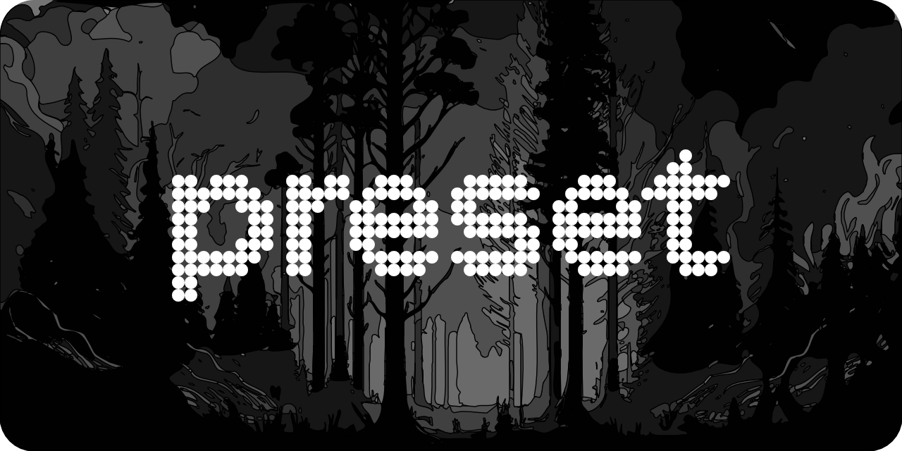

# preset

[](https://www.npmjs.com/package/@microflash/preset)
[](./LICENSE.md)

A modern CSS preset

- [What's this?](#whats-this)
- [Install](#install)
- [Use](#use)
- [Browser support](#browser-support)
- [Decisions](#decisions)
- [Credits](#credits)
- [License](#license)

## What's this?

`preset` is a CSS reset to baseline the browser styles to give you a uniform foundation for building your custom styles on top of it.

## Install

In Node.js, install with [npm](https://docs.npmjs.com/cli/install):

```sh
npm install @microflash/preset
```

In Deno, with [unpkg.com](https://unpkg.com):

```js
import "https://unpkg.com/@microflash/preset"
```

In browsers, with [unpkg.com](https://unpkg.com) or [jsdelivr.net](https://jsdelivr.net):

```css
<link rel="stylesheet" href="https://unpkg.com/@microflash/preset">
<link rel="stylesheet" href="https://cdn.jsdelivr.net/npm/@microflash/preset">
```

## Use

In Node.js or Deno, import the CSS in the entrypoint file of your application.

```js
import "@microflash/preset"
// or using URL import
import "https://unpkg.com/@microflash/preset"
```

Make sure that this is the first CSS import before including any other CSS files.

If you're using Sass, you can import Sass file instead of the compiled version. This is useful if you want to compile the CSS for custom browser targets.

You can import the Sass file in the entrypoint of your application as follows.

```js
import "@microflash/preset/scss"
// or using URL import
import "https://unpkg.com/@microflash/preset/src/preset.scss"
```

Alternatively, you can import it in your main Sass file before any other rules.

```scss
@use "@microflash/preset/scss";
// rest of the Sass imports
```

In browser, including the `<link>` before any other stylesheet should do the trick.

## Browser support

`preset` supports [evergreen browsers](https://browsersl.ist/#q=defaults%2C+not+IE+%3E+0).

## Decisions

The rationale behind the decisions for the `preset` are available as ADRs (Any Decision Records) under [decisions](./docs/decisions/).

## Credits

- [@joshwcomeau](https://github.com/joshwcomeau) for [My Custom CSS Reset](https://www.joshwcomeau.com/css/custom-css-reset/)
- [@KittyGiraudel](https://github.com/KittyGiraudel) for [Using calc to figure out optimal line-height](https://kittygiraudel.com/2020/05/18/using-calc-to-figure-out-optimal-line-height/)
- [@jgthms](https://github.com/jgthms) for [minireset.css](https://github.com/jgthms/minireset.css)
- [@EllyLoel](https://github.com/EllyLoel) for [reset.css](https://gist.github.com/EllyLoel/4ff8a6472247e6dd2315fd4038926522)

## License

[MIT](./LICENSE.md)
